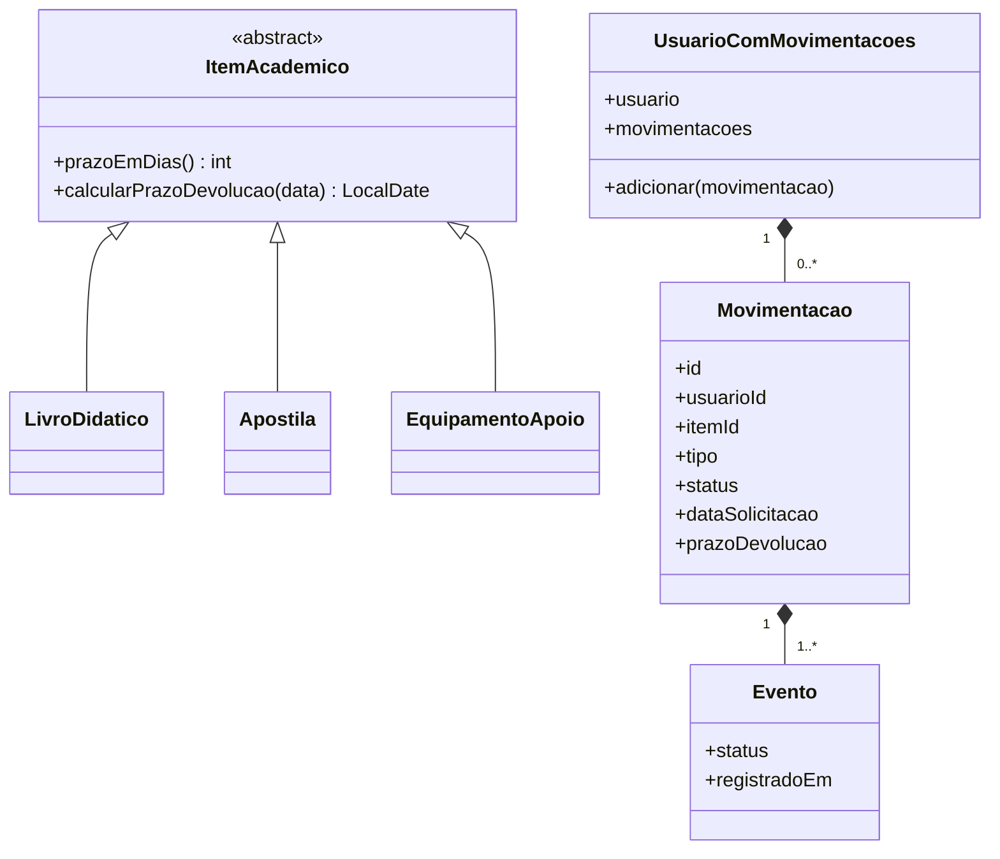
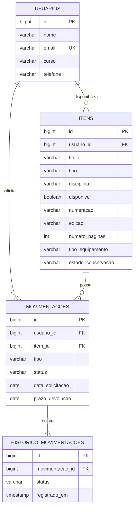

# Modelagem do OpenBook

Os diagramas abaixo descrevem a implementação da segunda entrega. Os arquivos de imagem anteriores registram a proposta inicial.

```mermaid
classDiagram
    class ItemAcademico {
        <<abstract>>
        +prazoEmDias() int
        +calcularPrazoDevolucao(data) LocalDate
    }
    ItemAcademico <|-- LivroDidatico
    ItemAcademico <|-- Apostila
    ItemAcademico <|-- EquipamentoApoio
    class UsuarioComMovimentacoes {
        +usuario
        +movimentacoes
        +adicionar(movimentacao)
    }
    class Movimentacao {
        +id
        +usuarioId
        +itemId
        +tipo
        +status
        +dataSolicitacao
        +prazoDevolucao
    }
    class Evento {
        +status
        +registradoEm
    }
    UsuarioComMovimentacoes "1" *-- "0..*" Movimentacao
    Movimentacao "1" *-- "1..*" Evento
```

```mermaid
erDiagram
    USUARIOS ||--o{ ITENS : disponibiliza
    USUARIOS ||--o{ MOVIMENTACOES : solicita
    ITENS ||--o{ MOVIMENTACOES : possui
    MOVIMENTACOES ||--|{ HISTORICO_MOVIMENTACOES : registra
    USUARIOS {
        bigint id PK
        varchar nome
        varchar email UK
        varchar curso
        varchar telefone
    }
    ITENS {
        bigint id PK
        bigint usuario_id FK
        varchar titulo
        varchar tipo
        varchar disciplina
        boolean disponivel
        varchar numeracao
        varchar edicao
        int numero_paginas
        varchar tipo_equipamento
        varchar estado_conservacao
    }
    MOVIMENTACOES {
        bigint id PK
        bigint usuario_id FK
        bigint item_id FK
        varchar tipo
        varchar status
        date data_solicitacao
        date prazo_devolucao
    }
    HISTORICO_MOVIMENTACOES {
        bigint id PK
        bigint movimentacao_id FK
        varchar status
        timestamp registrado_em
    }
```
